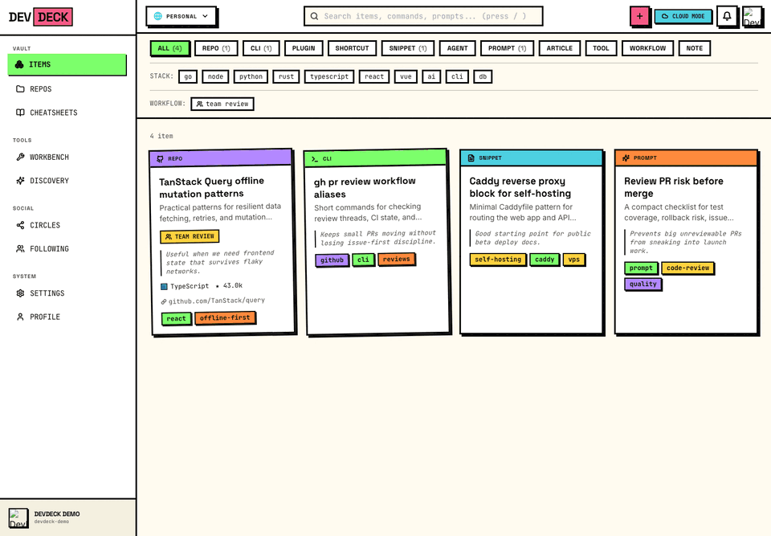
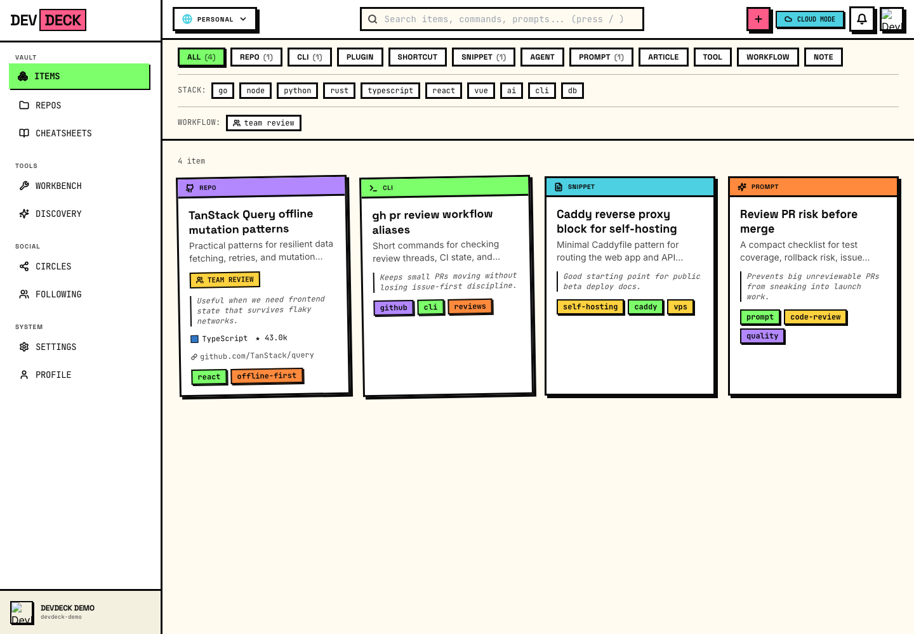
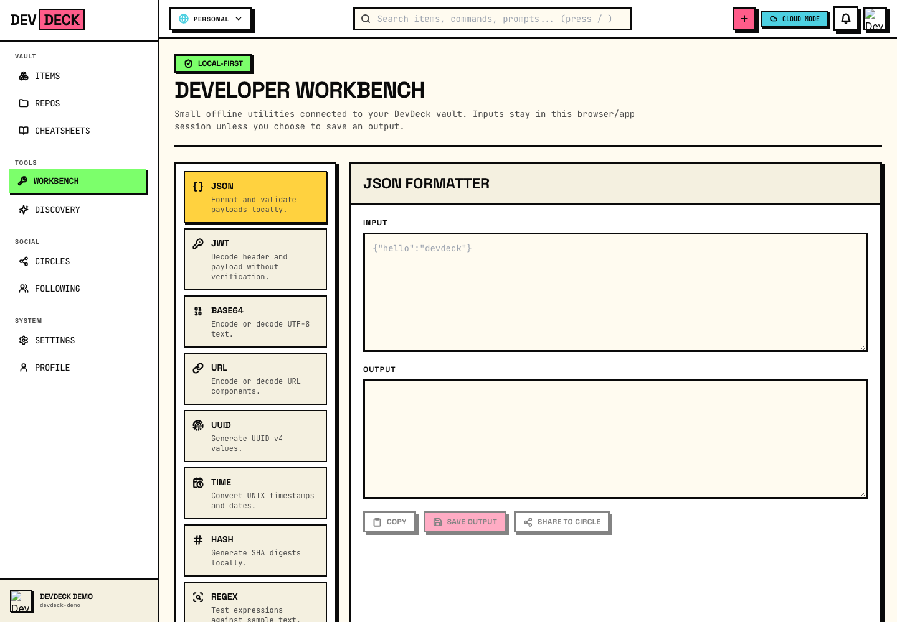
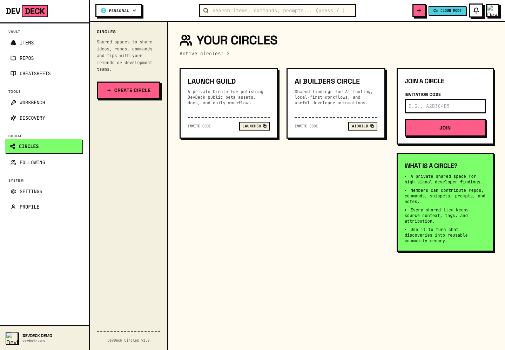
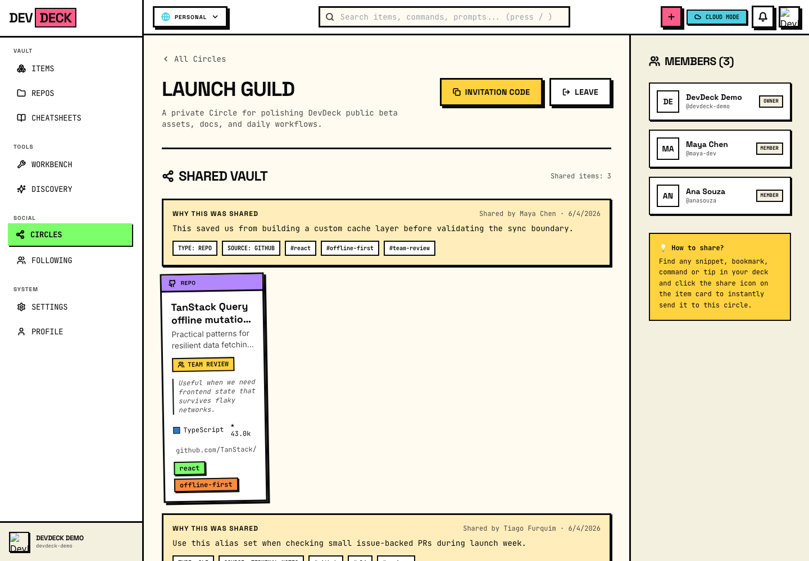

# DevDeck.ai

[](https://www.buymeacoffee.com/tiagofur)

> **The developer memory layer for everything useful you discover, build, and share.**

[Leer en español](README.es.md) · [Roadmap](ROADMAP.md) · [Contributing](CONTRIBUTING.md) · [First contribution](docs/FIRST_CONTRIBUTION.md) · [Support](docs/SUPPORT.md) · [Community model](docs/CIRCLES_COMMUNITY.md)

DevDeck is an open-source desktop/web app for developers who keep losing useful repos, CLIs, snippets, prompts, shortcuts, cheatsheets, and workflow notes across chats, bookmarks, browser tabs, and GitHub stars.

It turns scattered discoveries into a searchable engineering memory: capture useful artifacts, enrich them with context, retrieve them by intent, use them inside a developer workbench, and share high-signal findings with trusted Circles.

Domain: **[devdeck.ai](https://devdeck.ai)**

Current version: **0.5.0 Public Beta** — functional, useful, and actively being polished before a stable 1.0 release.

---

## Why this exists

Developers do not have a saving problem. We have a **rediscovery problem**.

You saw the perfect CLI in a Discord thread. A repo solved an auth problem. A prompt helped with a code review. A shortcut saved you five minutes. Three weeks later, you remember the shape of the solution — but not the name, link, flags, or context.

DevDeck is built for that moment.

It is not another bookmark graveyard. It is a practical, AI-assisted memory system for daily development work.

---

## The daily loop

1. **Capture** a repo, CLI, snippet, shortcut, prompt, article, runbook, or note.
2. **Add context**: why it matters, when to use it, tags, source, and gotchas.
3. **Retrieve by intent** using fuzzy and semantic search instead of exact names only.
4. **Use it in Workbench** for reusable developer workflows, snippets, requests, and project context.
5. **Share to Circles** so a group or community can build private collective memory instead of losing signal in chat.

This is the product direction: from “my saved links” to **our reusable engineering memory**.

---

## What is already in the app

- **Vault:** save and organize developer artifacts such as repos, CLIs, prompts, snippets, shortcuts, articles, tools, notes, and how-tos.
- **AI enrichment:** classify, summarize, and tag saved items with OpenAI or local Ollama-backed flows.
- **Search:** fuzzy and semantic retrieval powered by Postgres extensions such as `pg_trgm` and `pgvector`.
- **Developer Workbench:** reusable local utilities, command palette, saved requests, snippets, runbooks, and project context tools.
- **Circles:** private shared spaces where developers can contribute findings with context, attribution, source metadata, and tags.
- **Multi-surface app:** shared React feature package for Web and Desktop, plus a browser extension and Go CLI.
- **Offline-first direction:** local-first desktop/web architecture with sync-oriented docs and implementation work in progress.

DevDeck is still evolving. If something is rough, that is exactly where contributors can have a visible impact.

---

## Screenshots and demo



Launch-safe demo screenshots are generated from local demo data, not private user records.

| Vault | Workbench | Circles | Shared Circle vault |
|-------|-----------|---------|---------------------|
|  |  |  |  |

The core demo path is: capture useful developer artifacts, add context, use them in Workbench, then share high-signal findings with a trusted Circle.

See [docs/assets/launch/README.md](docs/assets/launch/README.md) to regenerate these assets.

---

## Stack

- **Desktop:** Electron + React 18 + TypeScript + Tailwind + Framer Motion
- **Web:** React 18 + Vite + React Router + TanStack Query
- **Backend:** Go + Chi + pgx + Postgres 16
- **Search:** `pg_trgm` + `pgvector`
- **AI:** OpenAI API and local Ollama-oriented flows
- **CLI:** Go
- **Extension:** Manifest V3 + Vite
- **Deploy:** Docker Compose + Caddy for self-hosted VPS deployments

### Monorepo layout

```txt
dev_deck/
├── apps/
│   ├── desktop/          # Electron app
│   ├── extension/        # Browser extension
│   └── web/              # Web app
├── packages/
│   ├── ui/               # Design system
│   ├── api-client/       # Fetch wrapper + TanStack Query hooks
│   ├── features/         # Shared pages and domain components
│   ├── i18n/             # Locale resources
│   └── realtime-client/  # Realtime collaboration client
├── backend/              # Go API
├── cli/                  # devdeck CLI
├── deploy/               # Docker Compose + Caddy
└── docs/                 # Product, architecture, launch, and ops docs
```

---

## Quick start for contributors

```bash
pnpm install
pnpm typecheck
pnpm test
```

Run the desktop app:

```bash
pnpm dev:desktop
```

Run the web app:

```bash
pnpm dev:web
```

Run the backend locally:

```bash
cd backend
cp .env.example .env
docker compose -f ../deploy/docker-compose.local.yml up -d db
go run ./cmd/api
```

See [CONTRIBUTING.md](CONTRIBUTING.md) for the full setup and PR flow.

---

## How to contribute

The project is especially looking for help with:

- UI/UX polish and responsive layout improvements.
- Desktop/Web parity fixes.
- Better onboarding and demo data.
- Circle/community collaboration flows.
- Search and AI enrichment quality.
- CLI, extension, and capture integrations.
- Tests, docs, and self-hosting reliability.

Before opening a PR:

1. Search existing issues.
2. Open or use an approved issue.
3. Keep the PR small and focused.
4. Include tests or a clear verification note.

Small, high-quality PRs are more valuable than giant feature drops.

New here? Start with [docs/FIRST_CONTRIBUTION.md](docs/FIRST_CONTRIBUTION.md), then pick a `good first issue` with `status:approved`.

---

## Support the project

DevDeck is an indie open-source project. Support helps fund domain/hosting costs, CI, development time, public beta polish, and AI-assisted coding tools used to move faster while still reviewing changes carefully.

- Sponsor/support: [Buy Me a Coffee](https://www.buymeacoffee.com/tiagofur)
- Read the support plan: [docs/SUPPORT.md](docs/SUPPORT.md)
- Share the repo with developers who collect tools, repos, commands, and workflows.
- Open issues with sharp feedback.
- Contribute small PRs that improve launch readiness.

Possible future sustainability paths include hosted community Circles, paid setup/support, curated workflow packs, and sponsorships — without compromising the open-source core.

---

## Documentation

| Doc | Content |
|-----|---------|
| [docs/CIRCLES_COMMUNITY.md](docs/CIRCLES_COMMUNITY.md) | Circles as private collective memory for developer communities |
| [docs/FIRST_CONTRIBUTION.md](docs/FIRST_CONTRIBUTION.md) | Short path for a first issue-backed PR |
| [docs/DEV_WORKBENCH.md](docs/DEV_WORKBENCH.md) | Developer Workbench direction and workflows |
| [docs/ARCHITECTURE.md](docs/ARCHITECTURE.md) | System architecture and technical design |
| [docs/API.md](docs/API.md) | API documentation |
| [docs/SELF_HOSTING.md](docs/SELF_HOSTING.md) | Self-hosting guide |
| [docs/TESTING_STRATEGY.md](docs/TESTING_STRATEGY.md) | Testing and CI strategy |
| [docs/LAUNCH_KIT.md](docs/LAUNCH_KIT.md) | Community launch copy and checklist |
| [docs/SUPPORT.md](docs/SUPPORT.md) | Funding, support, and sustainability plan |
| [ROADMAP.md](ROADMAP.md) | Product roadmap |

---

## License

Apache-2.0. See [LICENSE](LICENSE).
