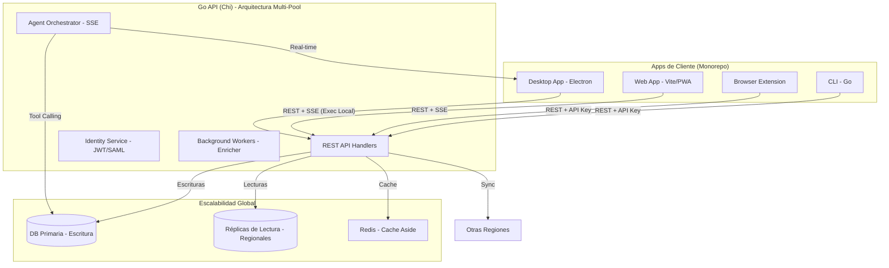

# DevDeck — Architecture (v1.0)

> Versión: 1.0 · Última actualización: Mayo 2026
>
> **Importante:** este doc cubre la arquitectura final de DevDeck tras completar las 17 olas del roadmap. El sistema ha evolucionado de una app personal a un **Knowledge OS** empresarial y colaborativo.

---

## 1. Vista de alto nivel



---

## 2. Componentes del Monorepo

Desde Wave 17, el monorepo pnpm workspaces es el núcleo del proyecto:

```
dev_deck/
├── apps/
│   ├── desktop/              # Electron + Native Shell support
│   └── web/                  # Vite + React (PWA capabilities)
├── packages/
│   ├── ui/                   # Design system Neo-Brutalista
│   ├── api-client/           # Unified SDK + TanStack Query hooks
│   ├── features/             # Shared Logic: Pages, Components, Agent Chat
│   └── realtime-client/      # Yjs + WebSockets support
├── backend/                  # Go API (Multi-tenant, Multi-pool)
├── cli/ extension/ deploy/
└── docs/                     # Documentación técnica v1.0
```

### 2.1 Orquestación de Agentes de IA (Ola 16)
Implementamos un motor de orquestación en el servidor que permite la ejecución de herramientas (**Tool Calling**).
- **Ejecución Híbrida**: El backend planea las tareas; el cliente (Desktop) las ejecuta localmente bajo supervisión humana (Fase 50).
- **Streaming**: Los estados del agente se envían al frontend mediante Server-Sent Events (SSE).

### 2.2 Sincronización y Escalabilidad (Ola 13-14)
- **Multi-region**: Soporte activo-activo con `APP_REGION`.
- **Réplicas de Lectura**: Las consultas de analíticas e insights se redirigen automáticamente a réplicas para no saturar el nodo primario.
- **Sync Engine**: Algoritmo LWW (Last Write Wins) atómico para conflictos en items polimórficos.

### 2.3 Identidad Enterprise (Ola 14-15)
- **SAML 2.0**: Integración con IdPs corporativos (Okta, Azure AD).
- **SCIM 2.0**: Aprovisionamiento automático de usuarios y grupos.
- **RBAC**: Control de acceso basado en roles (Owner, Admin, Editor, Viewer).

---

## 3. Modelo de Datos Polimórfico

La tabla central `items` soporta múltiples tipos (repos, snippets, clis, runbooks) mediante un campo `item_type` y una columna `meta` (JSONB) para datos específicos.
- **Vector Search**: Columna `embedding` (pgvector 1536-dim) para búsqueda semántica.
- **Activity Audit**: Tabla `activity_log` para tracking de inteligencia colectiva.

---

## 4. Decisiones de Diseño Clave

| Decisión | Por qué | Beneficio |
|----------|---------|-----------|
| **Hybrid Execution** | Seguridad primero | La IA propone, el humano aprueba en su terminal local. |
| **Monorepo Shared Features** | Velocidad de desarrollo | 100% de la lógica de dominio se comparte entre Web y Desktop. |
| **Offline-first with OPFS** | Resiliencia | DevDeck funciona en aviones y túneles; sincroniza al volver la red. |
| **Neo-Brutalismo UI** | Identidad de marca | Una estética "coder-centric" que destaca en el mercado. |

---

*Última actualización: Mayo 2026 (Lanzamiento v1.0)*
