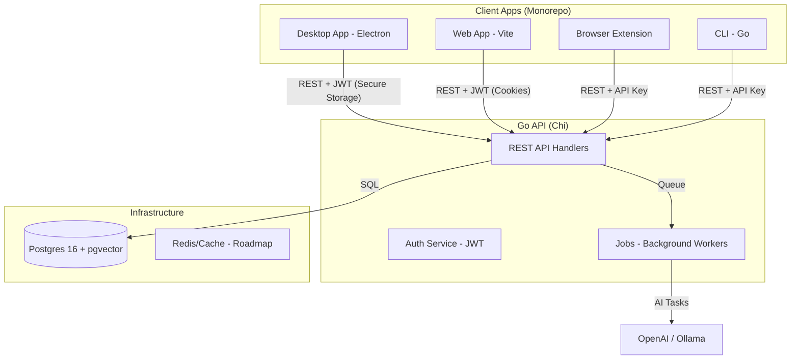

# DevDeck.ai Architecture

This document describes the technical architecture, data model, and system flow of **DevDeck.ai**.

[Leer en español](ARCHITECTURE.es.md)

---

## 1. High-Level Overview

### Monorepo Strategy
We use **pnpm workspaces** to share 100% of the domain logic between the Web and Desktop apps.
- **`apps/desktop`**: Electron shell (React renderer).
- **`apps/web`**: Web shell (BrowserRouter + Vite).
- **`packages/features`**: **Shared Core**. Contains all pages, components, and hooks.
- **`packages/ui`**: Neo-brutalist design system.
- **`packages/api-client`**: SDK and TanStack Query integration.

---

## 2. Tech Stack

### Frontend & Desktop
- **React 18 + TypeScript**: Core framework.
- **Tailwind CSS**: Neo-brutalist styling.
- **Framer Motion**: Smooth micro-animations.
- **Electron 32**: Native desktop integration (Mac/Win/Linux).
- **TanStack Query v5**: Server state management.

### Backend
- **Go 1.22+**: High-performance API server.
- **Chi**: Lightweight idiomatic router.
- **pgx v5**: Advanced Postgres driver.
- **JWT**: Stateless authentication with refresh token rotation.

### Database
- **Postgres 16**: Primary relational store.
- **pgvector**: Vector embeddings for semantic AI search.
- **pg_trgm**: Trigram-based fuzzy text search.

---

## 3. Detailed Data Model

### 3.1 Users and Authentication (GitHub-only)
We use GitHub OAuth as the sole identity provider.
- `users`: Stores GitHub profile metadata.
- `refresh_sessions`: Tracks active refresh tokens for session rotation.

### 3.2 Polymorphic Items (Wave 5)
The central entity is the `Item`. A single table handles multiple types via `item_type`.
- **Common fields**: `id`, `user_id`, `url`, `title`, `description`, `tags`, `embedding`.
- **Type-specific metadata**: Stored in JSONB or auxiliary tables (e.g., `repo_commands`).

### 3.3 Cheatsheets
- `cheatsheets`: Collections of commands by topic (e.g., Git, Docker).
- `cheatsheet_entries`: Individual command/shortcut definitions.

---

## 4. System Flows

### Adding a Repository
1. User pastes a URL in the UI.
2. Frontend calls `POST /api/items/capture`.
3. Backend checks if it's a GitHub URL.
    - **GitHub**: Fetches rich metadata via GitHub API.
    - **Generic**: Scrapes HTML for Open Graph tags.
4. AI Service (background) generates a summary and suggests tags.
5. Item is persisted in Postgres and the vector embedding is generated.

---

## 5. Deployment & Infrastructure

- **Docker Compose**: Orchestrates API, DB, and Caddy.
- **Caddy**: Acts as a reverse proxy with automatic TLS (Let's Encrypt).
- **GitHub Actions**: Continuous integration and deployment to a VPS.

---

*Last updated: May 2026 (Wave 5)*
