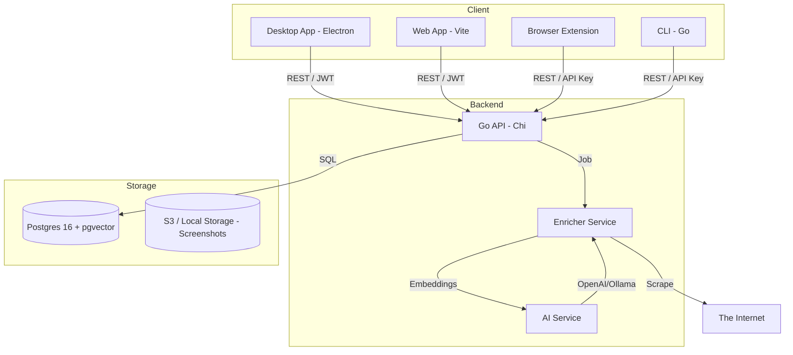

# DevDeck.ai Architecture

This document describes the technical architecture, data model, and flow of **DevDeck.ai**.

[Leer en español](ARCHITECTURE.es.md)

---

## 1. High-Level Diagram

---

## 2. Monorepo Structure

We use **pnpm workspaces** to manage the full stack:

- `apps/desktop`: Electron entry point and main process.
- `apps/web`: Web entry point (BrowserRouter).
- `packages/features`: **Core Logic**. 100% of pages and domain components shared between Web and Desktop.
- `packages/ui`: Design system (Button, Input, Neo-brutalist theme).
- `packages/api-client`: SDK for interacting with the Go API + TanStack Query hooks.
- `backend/`: Go source code.
- `cli/`: Go source for the CLI.

---

## 3. Tech Stack

### Frontend & Desktop
- **React 18 + TS**
- **Tailwind CSS** (Neo-brutalist theme)
- **TanStack Query v5** (Server state)
- **Framer Motion** (Animations)
- **Electron 32** (Desktop wrapper)

### Backend
- **Go 1.22+**
- **Chi** (HTTP Router)
- **pgx v5** (Postgres driver)
- **Go-Jet** (Type-safe SQL generation - Roadmap)

### Database & Search
- **Postgres 16**
- **pg_trgm** (Fuzzy search)
- **pgvector** (Semantic search / Embeddings)

---

## 4. Data Model (Wave 4)

### 4.1 Users & Sessions
- **Users:** GitHub ID, Login, Avatar.
- **Sessions:** JWT with Refresh Token rotation.

### 4.2 Items (Repos & URLs)
Currently, items are polymorphic but focused on URLs:
- `id`, `user_id`, `url`, `title`, `description`, `image_url`.
- `tags` (Array).
- `content_summary` (AI generated).
- `embedding` (Vector representation).

### 4.3 Cheatsheets
- **Cheatsheet:** Group of commands/shortcuts.
- **Entries:** Label, Command, Description.

---

## 5. Security
- **HTTPS** via Caddy.
- **JWT Auth** with HttpOnly cookies for Web and secure storage for Desktop.
- **API Keys** for CLI and Extension.
- **Allowlist:** During the beta phase, only specific GitHub logins are allowed to sign up.

---

## 6. Deployment
- **Docker Compose** for local and production environments.
- **Caddy** for automatic TLS and reverse proxy.
- **VPS** (Hetzner/DigitalOcean) for hosting.
