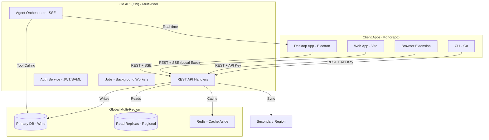

# DevDeck.ai Architecture

This document describes the technical architecture, data model, and system flow of **DevDeck.ai**.

[Leer en español](ARCHITECTURE.es.md)

---

## 1. High-Level Overview

```mermaid
graph TD
    subgraph Client ["Client Apps (Monorepo)"]
        D[Desktop App - Electron]
        W[Web App - Vite]
        E[Browser Extension]
        C[CLI - Go]
    end

    subgraph Backend ["Go API (Chi) - Multi-Pool"]
        G[REST API Handlers]
        S[Auth Service - JWT/SAML]
        J[Jobs - Background Workers]
        A[Agent Orchestrator - SSE]
    end

    subgraph Infrastructure ["Global Multi-Region"]
        RW[(Primary DB - Write)]
        RO[(Read Replicas - Regional)]
        RE[Redis - Cache Aside]
    end

    D -- "REST + SSE (Local Exec)" --> G
    W -- "REST + SSE" --> G
    E -- "REST + API Key" --> G
    C -- "REST + API Key" --> G

    G -- Writes --> RW
    G -- Reads --> RO
    G -- Cache --> RE
    G -- Sync --> RegionB[Secondary Region]
    
    A -- Tool Calling --> RW
    A -- Real-time --> D
```

### Monorepo Strategy
We use **pnpm workspaces** to share 100% of the domain logic between the Web and Desktop apps.
- **`apps/desktop`**: Electron shell with Native shell execution support.
- **`apps/web`**: Web shell with PWA capabilities.
- **`packages/features`**: **Shared Core**. Contains all pages, components, hooks, and agent chat UI.
- **`packages/ui`**: Neo-brutalist design system.
- **`packages/api-client`**: Unified SDK with TanStack Query.

---

## 2. Tech Stack

### Frontend & Desktop
- **React 18 + TypeScript**: Core framework.
- **Tailwind CSS**: Neo-brutalist styling.
- **Electron 32**: Native desktop integration with IPC-based shell execution.
- **Yjs/WebSockets**: Conflict-free concurrent editing (CRDTs).

### Backend
- **Go 1.22+**: High-performance API server.
- **Agent Orchestrator**: Server-side tool execution loop with Server-Sent Events (SSE).
- **Identity**: SAML 2.0 (SSO), SCIM 2.0 (Provisioning), and RBAC.

### Storage & Scalability
- **Postgres 16**: Primary relational store with `pgvector`.
- **Multi-Pool DB**: Decoupled `Reader()` and `Writer()` pools for read replicas.
- **Multi-Region Sync**: Atomic bidirectional synchronization with LWW (Last Write Wins).
- **SQLite (Local)**: OPFS on Web and native file storage on Desktop for offline-first.

---

## 3. Detailed Data Model

### 3.1 Users & Enterprise
- `users`: Core profile with onboarding status.
- `orgs`: multi-tenant organization support.
- `org_members`: RBAC mapping (Owner, Admin, Editor, Viewer).
- `saml_configs`: Enterprise SSO metadata.

### 3.2 Polymorphic Items
A single table handles multiple types (repos, clis, snippets, etc.) via `item_type`.
- `embedding`: 1536-dim vector for semantic search.
- `meta`: JSONB field for type-specific data.

### 3.3 Activity & Audit
- `activity_log`: Tracks all meaningful actions for team insights and audit trails.

---

## 4. System Flows

### Hybrid Agent Execution
1. User asks the agent to perform a task (e.g., "Install this repo").
2. **Backend Orchestrator** receives the request and consults the LLM.
3. LLM requests `search_vault` tool.
4. Orchestrator executes search locally on Postgres and returns results to LLM.
5. LLM requests `execute_shell_command` tool.
6. Orchestrator detects `IsClientSide: true`, pauses, and sends an SSE event to the **Desktop App**.
7. Desktop UI requests **User Approval**.
8. If approved, Desktop executes command via Electron `exec()` and sends stdout back to the Backend.
9. Orchestrator resumes reasoning and confirms success to the user.

---

## 5. Deployment

- **Infrastructure as Code**: Terraform + Docker Compose.
- **Security**: HMAC SHA-256 for webhooks, TLS everywhere, PATs with `devdeck_` prefix.

---

*Last updated: May 2026*
