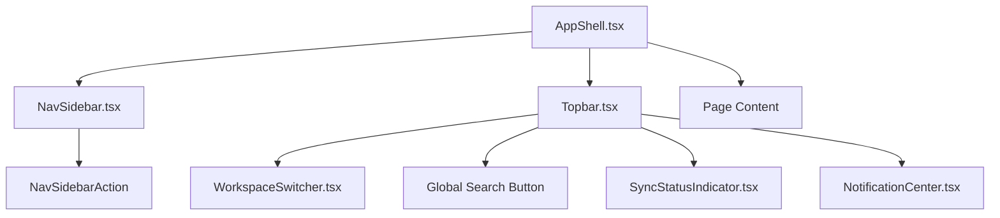

# Design: Navigation & Information Architecture Overhaul (P0.UX)

## 1. Architectural Decisions & Rationale
We are refactoring the global app shell from a single-column layout with an overloaded `Topbar` to a two-column sidebar layout. 

### Rationale
- **Cognitive Load Reduction:** Grouping ~35 distinct routes and features into 5 high-level sections (Vault, Tools, Social, Team, System) reduces cognitive friction.
- **Context Separation:** Hiding organization-specific feed/review features when a user is not working in an organization context keeps the interface clean and relevant.
- **Aesthetic Continuity:** Using identical tailwind layout configurations (borders, colors, and shadows) keeps the beloved neo-brutalist identity intact.

---

## 2. Component Structure



---

## 3. Detailed Layout Specifications

### 3.1 Two-Column App Layout (AppShell)
The main application viewport will be split using a flex row container:
- **Left Column (`NavSidebar`):** Has a fixed width of `16rem` (`w-64`) on desktop viewports. It is anchored to the left, has `border-r-3 border-ink bg-bg-card` and is persistent. On mobile viewports, it transitions into a fixed absolute overlay drawer (`z-45`) triggered by a custom state.
- **Right Column:** A `flex flex-col flex-1 min-w-0 h-screen overflow-hidden` container containing:
  - **Header (`Topbar`):** A fixed heights border-b section.
  - **Main Content:** Custom scrollable area depending on `AppShell` children.

---

## 4. Component Signatures & Interfaces

### 4.1 `NavSidebar` Property Signature
```typescript
interface NavSidebarProps {
  isOpen: boolean
  onClose: () => void
  reviewCount?: number
}
```

### 4.2 `AppShell` Property Signature
No breaking changes to property signature are required, but `AppShell` internal state will manage sidebar drawer visibility:
```typescript
interface AppShellProps {
  children: ReactNode
  query?: string
  onQueryChange?: (query: string) => void
  reviewCount?: number
  className?: string
  contentClassName?: string
}
```

### 4.3 `Topbar` Property Signature
Simplify the `Topbar` props by decoupling it from manual primary/secondary navigation handlers. It only needs triggers for Search and Capture:
```typescript
interface TopbarProps {
  query: string
  onQueryChange: (q: string) => void
  onAdd: () => void
  onGlobalSearch: () => void
  onMenuToggle: () => void // New: triggers mobile navigation drawer
  reviewCount?: number
}
```

---

## 5. Visual Styling Details (Tailwind CSS)
To preserve the premium neo-brutalist styling, we use the following styling classes:
- **Sidebar Borders:** `border-r-3 border-ink`
- **Sidebar Hover State:** `hover:bg-accent-yellow/40 hover:shadow-hard-sm` for nav links, or a solid border-button feel.
- **Active Section Styles:** `bg-accent-lime shadow-hard-sm border-2 border-ink` for the active page item in the navigation sidebar.
